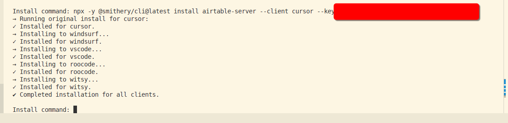

# Smithery MCP  Batch Installer

 

A simple bash script to expedite installing Smithery MCP servers onto multiple clients simultaneously. Now with two versions:
- **v1**: Takes a full install command with `--client cursor`
- **v2**: Takes just a package name (e.g., `@mcpserver/openrouterai`)

## Overview

This utility automates the process of installing Smithery MCP servers across multiple client applications. Instead of manually running installation commands for each client, this script allows you to run a single command and have it automatically replicated across your preferred list of clients.

## Why This Exists

When installing Smithery MCP servers, some installation commands contain the MCP key for the servers. This script preserves your Smithery key while changing only the target client, making it efficient to deploy across multiple environments.

## How It Works

1. The script takes a Smithery install command for the "cursor" client as input
2. It runs the original command for "cursor" first
3. Then automatically iterates through a predefined list of clients, replacing "cursor" with each client name
4. Each installation is confirmed upon completion

## Usage

1. Clone this repository
2. Modify the `TARGET_CLIENTS` array in `batch-installer.sh` with your preferred list of clients
3. Run the script:
   ```bash
   ./batch-installer.sh
   ```
4. When prompted, paste a complete Smithery install command that includes `--client cursor`
5. The script will execute the command for "cursor" first, then for each client in your list
6. Press Enter without input to exit the script

## Customizing Target Clients

Edit the `TARGET_CLIENTS` array in the script to include your desired clients:

```bash
# Static list of target clients (excluding 'cursor')
TARGET_CLIENTS=("windsurf" "vscode" "roocode" "witsy")
```

Replace with your preferred clients:

```bash
# Example with different clients
TARGET_CLIENTS=("vscode" "intellij" "sublime" "atom")
```

## Example

```
$ ./batch-installer.sh
Smithery Install Replicator (multi-package)
Paste a full Smithery install command for '--client cursor'.
Press Enter without input to quit.

Install command: npx -y @smithery/cli@latest run @smithery-ai/github --client cursor --key d708c05d-f7cc-48ee-907f-e9beb9b9f854
→ Running original install for cursor:
✓ Installed for cursor.
→ Installing to windsurf...
✓ Installed for windsurf.
→ Installing to vscode...
✓ Installed for vscode.
→ Installing to roocode...
✓ Installed for roocode.
→ Installing to witsy...
✓ Installed for witsy.
✔ Completed installation for all clients.

Install command: 
Done.
```

## Notes

- The script requires a command that includes `--client cursor`
- Output from the installation commands is suppressed for cleaner display
- The script automatically answers "no" to any prompts during installation

## Version 2 (Package-Based Installation)

The v2 script simplifies the process further by only requiring the package name.

### How It Works (v2)

1. The script takes a package name (e.g., `@mcpserver/openrouterai`) as input
2. It automatically constructs the full installation command
3. It iterates through a predefined list of clients, installing the package for each one
4. Each installation is confirmed upon completion

### Usage (v2)

1. Run the v2 script:
   ```bash
   ./batch-installer-v2.sh
   ```
2. When prompted, paste a package name (e.g., `@mcpserver/openrouterai`)
3. The script will execute the installation for each client in the list
4. Press Enter without input to exit the script

### Example (v2)

```
$ ./batch-installer-v2.sh
Smithery Install Replicator v2 (package-based)
Paste a package name (e.g., @mcpserver/openrouterai)
Press Enter without input to quit.

Package name: @mcpserver/openrouterai
→ Installing @mcpserver/openrouterai to windsurf...
✓ Installed for windsurf.
→ Installing @mcpserver/openrouterai to vscode...
✓ Installed for vscode.
→ Installing @mcpserver/openrouterai to roocode...
✓ Installed for roocode.
→ Installing @mcpserver/openrouterai to witsy...
✓ Installed for witsy.
→ Installing @mcpserver/openrouterai to cursor...
✓ Installed for cursor.
✔ Completed installation for all clients.

Package name:
Done.
```

### Customizing Target Clients (v2)

Edit the `TARGET_CLIENTS` array in the v2 script to include your desired clients, similar to the v1 script.
